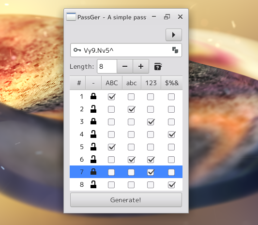

PassGer
====================================================================================================
Description
----------------------------------------------------------------------------------------------------
A simple password generator.

You can specify the type of characters to use for each index of the password.

You can also set the characters to be used and the characters not to be used one by one. (For
example, some people don’t want to use “[” or “]” in their passwords.)

This makes it easy to generate passwords that are not only strong but also easy to remember, and
prevent password mistakes that often occur due to browser auto-save.  
That's because if you have multiple accounts on one site, your browser will often confuse them.  
If you run into such a problem on your smartphone while you're on the go, remembering your password
may help you.  
Isn't that the case?

From a security point of view, this app does not have a function to save.

Copy & paste the password generated by this app into an administrative app such as GNOME Password
safe and save it.

Build
----------------------------------------------------------------------------------------------------
### Requirements
* GTK+-3.0 (e.g. libgtk-3-dev)
* gcc
* make
* vala compiler (valac)

### Instruction for building this code

    $ make

or if you want to use meson build system, try this:

    $ meson build --prefix=/usr
	$ cd build
	$ meson compile # or ninja

Install
----------------------------------------------------------------------------------------------------
Running make will generate an executable file called “passger” in the current directory. You can start
using it as soon as you copy it to a location that is in your PATH environment variable.

or

Use `make install` command with a variable `PREFIX`.

    $ make intsall PREFIX=~/.local

If you are using meson, try this on the build directory:

    $ sudo meson install

Credit
----------------------------------------------------------------------------------------------------
Copyright 2021 (C) Tanaka Takayuki <https://github.com/aharotias2>
