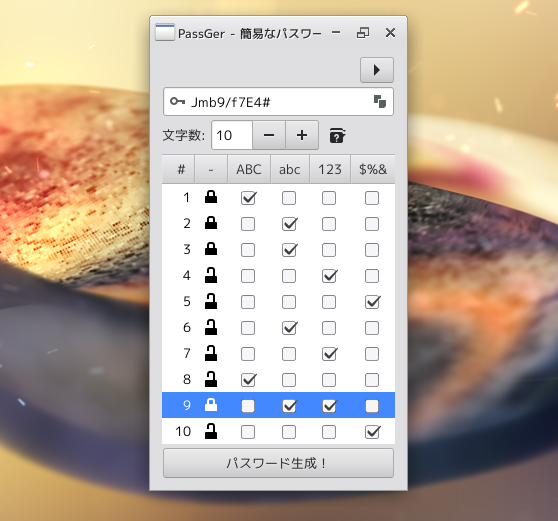
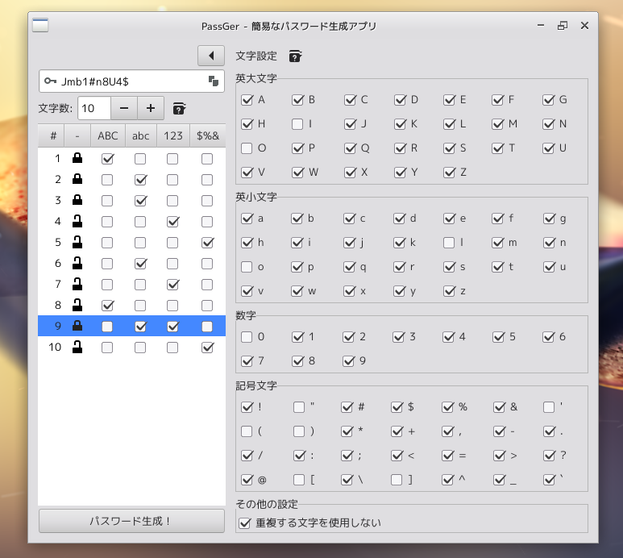

PassGer
====================================================================================================
説明
----------------------------------------------------------------------------------------------------
簡易なパスワード生成アプリ。

パスワードに使う文字の種類を一文字ごとに指定できます。

また文字の種類ごとに使用したい文字を指定できます。  
たとえば、`[`や`]`をパスワードに使用したくない人もいるでしょう。

このことにより、強度があるだけでなく記憶もしやすいパスワードを容易に生成でき、ブラウザの自動保存によ
りしばしば発生するパスワードの取り違えを防ぐことができます。  
それと言うのも一つのサイトで複数のアカウントを使っている場合、ブラウザはしばしばそれらを取り違えるか
らです。  
外出時にスマートフォンでそのような問題にぶつかったとき、パスワードを記憶していれば難を逃れられるかも
しれません。  
そういうことはありませんか？

セキュリティの観点からこのアプリは保存機能を持っていません。

GNOME Passwordsafeのような信頼性の高いパスワード管理用アプリを用意し、コピー&ペーストして保存してく
ださい。

### [参考] 特定の文字列を含むパスワードを作成する
また、特定の文字列を含むパスワードを生成したい場合、あらかじめそれを入力しておき、ロックを掛け、その
上でパスワード生成ボタンを押下すれば残りをランダムにすることができます。

まず何か特定の文字列をエントリーに直接入力します。

下の表を使って、最初の5文字をロックします。

表のヘッダーをクリックして、英字のチェックを外します。

「パスワード生成！」ボタンを押下します。

特定の文字列「Wanco」から始まるランダムなパスワードを生成できました。

注意事項
----------------------------------------------------------------------------------------------------
あまりにも単純でパターン化されたパスワードを多様すると推測されやすくなる恐れがあります。  
そのことに留意した上でご使用いただければと思います。  
このアプリケーションにより発生したいかなる損害にも責任を負うことはできません。

ビルド
----------------------------------------------------------------------------------------------------
### 準備
* GTK+-3.0 (e.g. libgtk-3-dev)
* gcc
* make
* vala compiler (valac)

### ビルド手順
手早くビルドしたい人向け (デバッガー等) にMakefileが用意されています。

    $ make

より推奨される方法は「Mesonビルドシステム」を使用することです。

    $ meson build --prefix=/usr
	$ cd build
	$ meson compile # or ninja

インストール
----------------------------------------------------------------------------------------------------
`make`によって生成された実行可能ファイル`passger`をすぐに起動できます。
環境変数PATHが通っているロケーションに移動して使用してください。

あるいは`PREFIX`引数を指定して`make install`によってもインストール可能です。

    $ make intsall PREFIX=~/.local

Mesonを使用する場合、以下のコマンドを使用してください。

    $ sudo meson install

クレジット
----------------------------------------------------------------------------------------------------
Copyright 2021 (C) Tanaka Takayuki <https://github.com/aharotias2>
